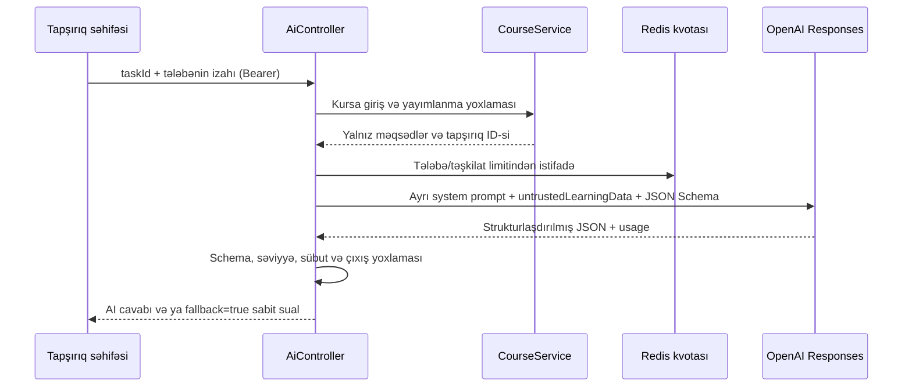

> Cari aktiv provider **Groq**, model **openai/gpt-oss-20b**. Açar yalnız `.env.groq.local` faylında saxlanır. Yeni Java adapterindən real cavab alınıb, tam backend schema və səviyyə yoxlaması keçib (607 input / 528 output token). Aşağıdakı Claude balans qeydi əvvəlki provider-in tarixi vəziyyətidir.

> Claude yeniləməsi: `AI_PROVIDER=claude`, `CLAUDE_MODEL=claude-sonnet-4-6`, `ANTHROPIC_API_KEY` əlavə edilib. Claude açarı `backend/.env.claude.local` faylındadır; Compose əmrinə ikinci `--env-file` kimi verilir. Model endpoint-i açarı qəbul edib; Messages çağırışı kredit çatışmazlığına görə HTTP 400 qaytarıb. Kredit əlavə etmək istifadəçinin növbəti addımıdır. Pentest/test suite işlədilməyib.

# AI inteqrasiyası — mövcud implementasiya

## Axın

`ai` ayrıca Maven moduludur. Provider portu `AiProvider`, hazır adapterlər `OpenAiProvider` və `ClaudeProvider`-dir. Claude və OpenAI config-dən seçilir; Gemini və avtomatik provider fallback gələcək işdir. Model environment-dən seçilir, brauzerdən seçilmir.

## Hazır endpoint-lər

- `GET /api/v1/ai/status`: authenticated; configured/provider/model/allowedHintLevel/mode.
- `POST /api/v1/organizations/{org}/courses/{course}/tasks/{task}/ai/hint`: authenticated; `{ "explanation": "…" }`.

Cavab `{requestId,hint,fallback,source,provider,model,promptVersion,message}`; hint `difficulty,evidenceAttemptIds,needsClarification,clarifyingQuestion,hintLevel,hintText,confidence` sahələridir.

## Kontekst və hədlər

Backend yalnız task ID, yayımlanmış kursun öyrənmə məqsədləri, tələbə izahı və icazə verilən səviyyəni göndərir. Tam entity, task instructions, email, JWT, refresh token və secret konfiqurasiyası model kontekstinə daxil edilmir. Hazırkı rejim **kurs müəllimi köməkçisidir**, real laboratoriya cəhdi diaqnozu deyil. Ona görə `recentAttempts`, `approvedExplanations`, `evidenceAttemptIds` boşdur və `hintLevel` həmişə backend tərəfindən 1-dir. Uydurulmuş attempt ID-ləri rədd edilir.

Öyrənmə məqsədləri RAG sayılmır. pgvector və müəllim tərəfindən təsdiqlənmiş izah bazası hələ qoşulmayıb. Lab uğuru və mastery AI cavabından hesablanmır.

Prompt və schema `ai/src/main/resources/ai/` içində ayrıca versiyalı fayllardır. NetworkNT JSON Schema validator çıxışı yoxlayır. Clarification/null uyğunluğu, sübutların boşluğu və səviyyə ayrıca yoxlanır. Sadə flag/token nümunələri və konfiqurasiya secret-lərinin təkrarı rədd edilir; bu tam sızma təminatı və ya AI eval sübutu deyil. Çıxış React mətnidir, kod/HTML icra edilmir.

## Davamlılıq və usage

- Provider hostu sabit `https://api.openai.com/v1/responses`; redirect yoxdur, istifadəçi target URL seçmir.
- `store:false`, 1200 output token həddi, 5 saniyə connect timeout, 25 saniyə request timeout.
- Resilience4j circuit breaker; instansiyada maksimum 12 paralel çağırış.
- Schema xətasında bir əlavə cəhd. Şəbəkə/provider xətasında birbaşa sabit fallback.
- Bucket4j/Redis: tələbəyə 5 sorğu/dəqiqə, default 30/24 saat; təşkilata default 1000/24 saat. Interval ilk bucket yaradılmasından başlayır, UTC təqvim günü deyil. İki bucket konservativ ardıcıllıqla xərclənir; təşkilat rədd etdikdə istifadəçinin bir slotu istifadə olunmuş qala bilər. Hər istifadəçi sorğusu maksimum iki provider çağırışı yarada bilər.
- Token sayları, model, provider, prompt versiyası, latency və request ID loglanır. İzah/prompt/raw cavab/key loglanmır.
- Dəqiq pul xərci, DB usage ledger, semantik cache, provider fallback, prompt DB/A-B və SSE hələ implementasiya edilməyib. İndiki cavab adi JSON-dur; frontend gözləmə vəziyyətini göstərir.

## Konfiqurasiya

`OPENAI_API_KEY`, `OPENAI_MODEL`, `AI_STUDENT_DAILY_LIMIT`, `AI_ORGANIZATION_DAILY_LIMIT` yalnız backend-də saxlanır. İlk ikisi boş olanda `configured=false` və `fallback=true` qaytarılır; bu AI cavabı kimi təqdim olunmur.

Cari environment-də Claude açarı var; authentication qəbul edilib, generasiya kredit çatışmazlığına görə rədd edilib. Uğurlu AI cavabı və keyfiyyət qiymətləndirilməsi hələ təsdiqlənməyib. İstifadəçi pentest/yoxlamanı dayandırdıqdan sonra yalnız compile/build aparılıb.

API müqaviləsi üçün rəsmi mənbə: [OpenAI Structured Outputs](https://developers.openai.com/api/docs/guides/structured-outputs?api-mode=responses).

## Claude adapteri

Sabit endpoint `https://api.anthropic.com/v1/messages`, `x-api-key` və `anthropic-version: 2023-06-01`; system prompt ayrı, `output_config.format` JSON Schema. Claude-un dəstəkləmədiyi uzunluq/say hədləri wire schema-dan təsvirə keçirilir, tam orijinal schema backend-də dəyişmədən validasiya edilir. Cavab yalnız `stop_reason=end_turn` olduqda qəbul edilir. 25 saniyə ümumi çağırış həddi, redirect yoxdur. Balans/auth/rate-limit səbəbləri yalnız təhlükəsiz kateqoriya kimi loglanır; raw error body və açar yazılmır.

Mənbə: [Claude Structured Outputs](https://platform.claude.com/docs/en/build-with-claude/structured-outputs).

## Groq adapteri

`GroqProvider` sabit `https://api.groq.com/openai/v1/chat/completions` endpoint-inə Bearer auth ilə qoşulur. `response_format.json_schema.strict=true`, 2000 completion token həddi və 25 saniyə ümumi çağırış timeout-u istifadə olunur. `finish_reason=stop` və backend schema validasiyası olmadan cavab təqdim edilmir. Raw cavab/key loglanmır. Provider environment-dən seçilir.

İşə salma: `docker compose --env-file backend/.env --env-file backend/.env.groq.local -f backend/compose.yml up -d --build app`.

Rəsmi müqavilə: [Groq Structured Outputs](https://console.groq.com/docs/structured-outputs).
