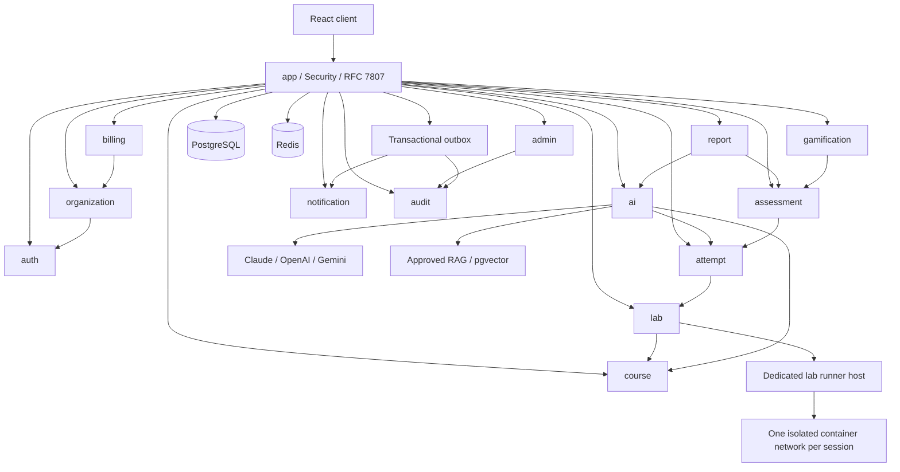

# HackTrain backend arxitekturası

Bu sənəd tam platformanın hədəf müqaviləsidir. `STATUS.md` real icra və yoxlama vəziyyətini göstərir. React auth/organization/course ekranları Java API-yə bağlanıb; qalan köhnə prototip ekranlarının keçidi gələcək işdir. Sənəddəki dar MVP təklifi deyil, istifadəçinin geniş platforma tələbi əsas götürülür.

## Modul sərhədləri

Java 21 və Spring Boot 3.5 üzərində Maven modular monolith seçilir: bir deploy və bir tranzaksiya sistemi ilkin əməliyyat xərclərini azaldır. Hər modul `api`, `application`, `domain`, `infrastructure` paketlərinə ayrılır; başqa modulun repository/entity-sinə giriş qadağandır. Kiçik auth modulunda paket səviyyəsində qapalı entity/repository ilə eyni sərhəd tətbiq edilir. Modullar bir-birinə public facade və outbox hadisələri ilə müraciət edir. `app` yalnız kompozisiya, konfiqurasiya və Flyway sahibidir. Auth global identity saxlayır, təşkilat rolları organization modulunun membership-lərindədir.

## Tranzaksiya və tenant izolyasiyası

Tenant ID heç vaxt JWT-dən və ya HTTP header-dən yoxlanmadan qəbul edilmir. `/organizations/{orgId}` yolundakı təşkilat üçün aktiv membership, rol və müəllimin qrup təyinatı yoxlanır. Tələbə yalnız öz sessiya/cəhd/hesabatını görür. Platforma admin əməliyyatları ayrıca icazə və audit tələb edir. Tenant daxilində bütün FK-lar `(organization_id, id)` cütü ilə qurulur; təşkilatlararası bağlantı DB səviyyəsində mümkün olmur. Repository metodlarında organization ID məcburidir. PostgreSQL RLS əlavə müdafiədir: `SET LOCAL app.organization_id` yalnız tranzaksiya daxilində, tətbiq DB rolunda `NOBYPASSRLS`, cədvəllərdə `FORCE ROW LEVEL SECURITY`. Migration rolunun parolu runtime konteynerində saxlanılmır. Pool-a tenant vəziyyəti daşınmır. Tenant header-i identity mənbəyi deyil.

Auth hesabı təşkilatdan müstəqildir. Login yalnız STUDENT baza authority verir; TEACHER və ORG_ADMIN hüquqları təşkilat membership-ində yoxlanır. SUPER_ADMIN yaradılması public API-dən mümkün deyil; ilk admin əməliyyat runbook-u və audit ilə idarə edilir. İstifadəçi bloklanması və parol dəyişməsi token versiyasını artırır; hər authenticated request DB-də hesab statusunu və token versiyasını yoxlayır.

## Auth qərarları

Access JWT 10 dəqiqə yaşayır, issuer/audience/HS256 və vaxt yoxlamaları var. HS256 secret ən azı 32 random baytdır; yalnız app imzalayır/yoxlayır. Gələcək ayrıca verifier xidmətləri üçün JWKS/RS256 keçidi nəzərdə tutulur. Refresh credential 256-bit opaque random token-dir; serverdə yalnız SHA-256 digest saxlanılır. Refresh token-in JWT olması əlavə səlahiyyət vermədiyinə və yenə revocation DB tələb etdiyinə görə opaque format seçilir. Bu, access+refresh tələbini təmin edir; refresh formatı bilərək JWT deyil. Ailənin mütləq bitmə tarixi 30 gündür, rotasiya onu uzatmır. Təkrar istifadə ailəni ləğv edir, tranzaksiya rollback etmədən 401 qaytarılır. Bütün user credential mutasiyaları eyni user row lock ilə seriallaşdırılır.

Token-lər JSON ilə qaytarılır; cookie authentication yoxdur və CSRF bu stateless bearer API üçün söndürülür. Frontend access token-i yaddaşda saxlamalıdır; refresh token-i localStorage-da saxlamamalıdır. Brauzer persistent login üçün gələcək BFF/HttpOnly cookie adapterində CSRF qorunması əlavə olunmalıdır. CORS konkret origin allowlist-dir. Parol BCrypt limitinə görə UTF-8 72 baytdan uzun qəbul edilmir. Verification/reset token-ləri hash-lənir, bir dəfə işləyir, məqsəd və vaxtla məhdudlaşır. Parol reset bütün sessiyaları ləğv edir. Qeydiyyat/reset/resend naməlum və məlum email üçün eyni public nəticə qaytarır.

SMTP mesajları DB outbox-a eyni tranzaksiyada yazılır. Outbox payload AES-GCM ilə şifrələnir; uğurlu göndərişdən sonra payload silinir, retry exponential backoff-dur. SMTP cavabından sonra DB commit itərsə təkrar email mümkündür (at-least-once). Token və parol application loglarına yazılmır. Auth təhlükəsizlik hadisələri eyni tranzaksiyada qeydə alınır.

## Laboratoriya sərhədi

Tətbiq Docker socket almır. Ayrı hostdakı runner yalnız mTLS ilə, imzalanmış session ID və allowlist template digest ilə idarə olunur. İstifadəçi host/URL/image seçmir. Template-lər hər vulnerability üçün A/B/C variantları və versiyalı yoxlayıcı saxlayır. Hər sessiyanın ayrıca internal şəbəkəsi, unprivileged UID-si, read-only rootfs-i, tmpfs-i, cap-drop ALL, no-new-privileges, seccomp/AppArmor, pids/CPU/RAM limiti və hard deadline-ı var. Host firewall-da egress bloklanır; internal Docker network təkbaşına host/metadata izolyasiyası sayılmır. Runner app/DB/Redis şəbəkəsinə qoşulmur. TTL sweeper həm DB, həm Docker label-lərindən orphan-ları silir. Açılış/bağlanış idempotent state machine-dir: REQUESTED → STARTING → RUNNING → STOPPING → STOPPED/EXPIRED/FAILED. Reset yeni generation yaradır; köhnə cəhd yeni yoxlamaya daşınmır.

Cəhd əvvəl PENDING kimi yazılır, sorğu yalnız runner proxy ilə icazəli local lab-a gedir, nəticə ölçü limiti ilə saxlanır. Texniki verifier imzası, nonce, session/generation və attempt ID yoxlanır; client `success` göndərə bilməz. AI kodu icra edilmir. Normal funksiyanın qorunması ayrıca yoxlama nəticəsidir. Cavab body-si yox, redaktə edilmiş xülasə AI-yə ötürülür.

## AI sorğu axını

1. Tenant, student, lab ownership, köməksiz mərhələ və hint entitlement yoxlanır; DB-də hint allocation və budget reservation atomikdir.
2. Son N cəhd `AttemptEvidence` DTO-suna çevrilir. Flaq, verifier key, container env və secret entity-lər bu facade-a verilmir. İstifadəçinin öz mətnində mümkün secret-lər ayrıca redaktə edilir.
3. pgvector yalnız eyni tenant/mövzu, approved status, cari revision, təsdiqləyən müəllim və embedding model/dimension üzrə axtarır. Qaytarılan mətn token limitinə sığdırılır. Approval ləğvində cache revision dəyişir.
4. Prompt seçimi hash(student, experiment) üzrə sabitdir. System prompt və student data ayrı mesajlardır. Provider context-də yalnız tələb olunan ID/məqsəd/cəhd xülasəsi/izah/hint səviyyəsi/approved RAG var.
5. Cache key tenant, student, session generation, evidence IDs, context digest, entitlement, prompt version, model və RAG revision ehtiva edir. Təşkilatlar/tələbələr arasında cache paylaşılmır.
6. Provider timeout/circuit breaker/bounded retry; hər fiziki çağırış ayrıca usage/cost qeydidir. Provider qiymətləri versiyalı config-dən gəlir; günün UTC sərhədində tenant və student limitləri əvvəlcədən maksimum token xərcini rezerv edir. Usage gəlməzsə konservativ rezerv saxlanır.
7. JSON Schema, evidence ID altçoxluğu, hint səviyyəsi, clarification consistency, secret/payload filtri və çıxış uzunluğu yoxlanır. Retry-dan sonra digər provider, sonra təsdiqlənmiş sabit hint. Köməksiz mərhələdə fallback da qadağandır.
8. SSE əvvəl `accepted`, sonra yalnız TAM validasiya edilmiş `hint`, sonda `completed` ötürür. Raw model token-lərinin dərhal stream edilməsi sızma yoxlamasını keçə bildiyi üçün istifadə edilmir. Reconnect request ID ilə idempotentdir; hint səviyyəsini təkrar artırmır.

AI texniki uğur, mastery və billing statusunu dəyişmir. İzah qiymətləndirməsi ayrıca sübuta bağlı müəllim təsdiqi tələb edə bilər. RAG daxilində təlimat görünən mətn data sayılır; prompt injection sadəcə regex-lə həll edilmiş sayılmır. Canary secret və real validation testləri mütləqdir.

## Qiymətləndirmə və ölçmələr

SkillEvidence immutable attempt ID, verifier version, criterion, help level, variant və generation saxlayır. Mastery NO_EVIDENCE → ASSISTED → INDEPENDENT ardıcıllığında sübuta əsaslanır. B variantında əvvəlki A həllinin başqa tələbədən və ya report endpoint-dən sızması da yoxlanır. Rubric revision dəyişəndə köhnə sübut ayrıca göstərilir. Pilot assignment random və counterbalanced-dir; razılıq versiyası və tarix saxlanır. Median yalnız tamamlanmış sessiyalarla yanaşı censored/yarımçıq sayları ilə göstərilir. AI-versus-static müqayisəsi causal zəmanət kimi təqdim edilmir.

## Billing, məlumat və əməliyyatlar

Aktiv tələbə ay ərzində ilk billable sessiyası ilə, unikal `(org, month, student)` qeydi ilə sayılır. Webhook signature/timestamp yoxlanır, event ID unique-dir, replay idempotentdir. Plan limitləri serverdə tətbiq edilir. Payment provider hesabı seçilmədən real ödəniş inteqrasiyası tamamlanmış sayılmır.

GDPR export asinxron job, qısaömürlü download və CSV formula escaping tələb edir. Deletion üçün identity yoxlaması, sessiyaların ləğvi, PII redaksiyası, object-store və backup retention runbook-u var; qanuni maliyyə/audit retention ayrıca sənədləşdirilməlidir. Bu texniki tədbirlər hüquqi uyğunluq sertifikatı deyil.

Outbox consumer-ləri idempotent, retry-lər bounded, dead-letter alert-ləri var. JSON log correlation ID ehtiva edir, token/body/izah daxil etmir. Prometheus label-lərinə user/tenant ID qoyulmur. Management port yalnız ops şəbəkəsindədir. DB/Redis backup restore məşqi, secret rotasiyası, migrasiya rollback əvəzinə forward fix, dependency/container scan, staging smoke və təsdiqli deploy production gate-ləridir. 500 virtual user yük sınağı ölçülmədən throughput iddiası verilmir.

## Rəsmi texniki istinadlar

- Spring Boot 3.5: https://docs.spring.io/spring-boot/3.5/reference/index.html
- Java uyğunluğu: https://docs.spring.io/spring-boot/3.5/system-requirements.html
- Maven: https://maven.apache.org/ref/3.9.11/apache-maven/summary.html

Dependency versiyalarının repo-da həqiqətən resolve olunması və test nəticəsi `STATUS.md`-də qeyd edilir; sənəd özü build sübutu deyil.
