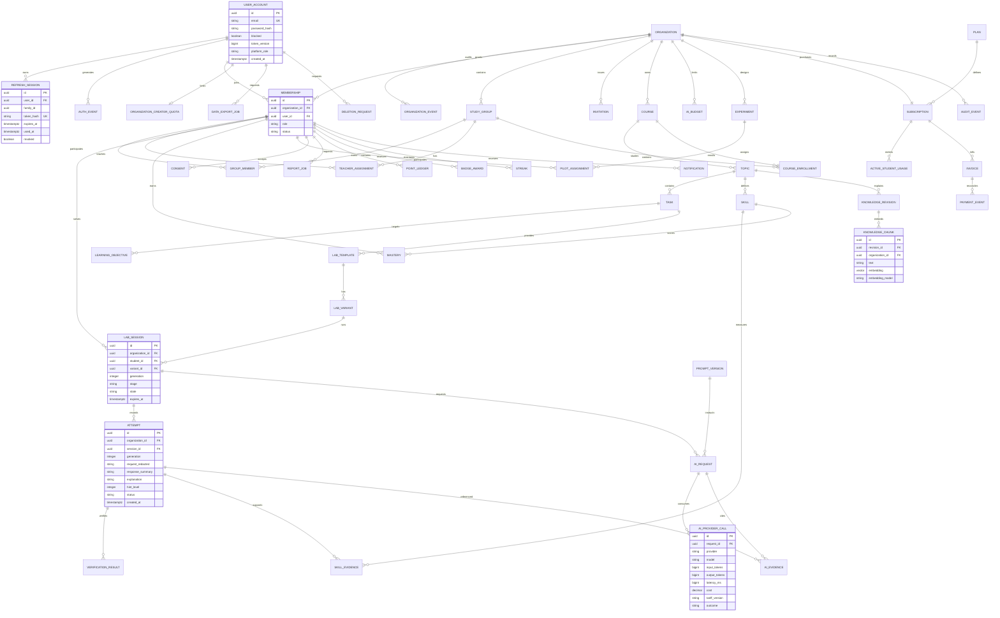

# Hədəf məlumat modeli

Aşağıdakı diaqram bütün platforma üçün nəzərdə tutulur. Auth cədvəlləri `V1__identity.sql` və email göndərişindən qalan obyektləri təmizləyən `V4__remove_email_delivery.sql`, təşkilat/üzvlük/qrup/dəvət/audit/creation-quota cədvəlləri `V2__organizations.sql`-dədir. Kurs/mövzu/tapşırıq/məqsəd/təyinat hadisələri `V3__courses.sql`-dədir. Qalan cədvəllər modul implementasiyası ilə ardıcıl migrasiyalarda yaradılacaq; diaqram migration kimi təqdim edilmir. Bütün tenant cədvəllərində organization_id, created_at, optimistic version, tenant daxilində unique və composite foreign key nəzərdə tutulur.

